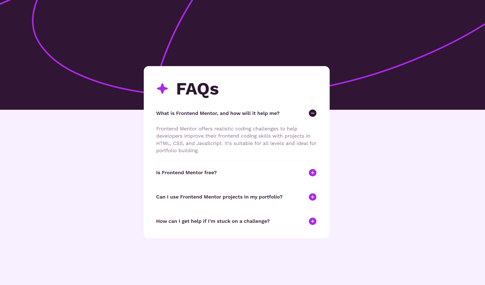
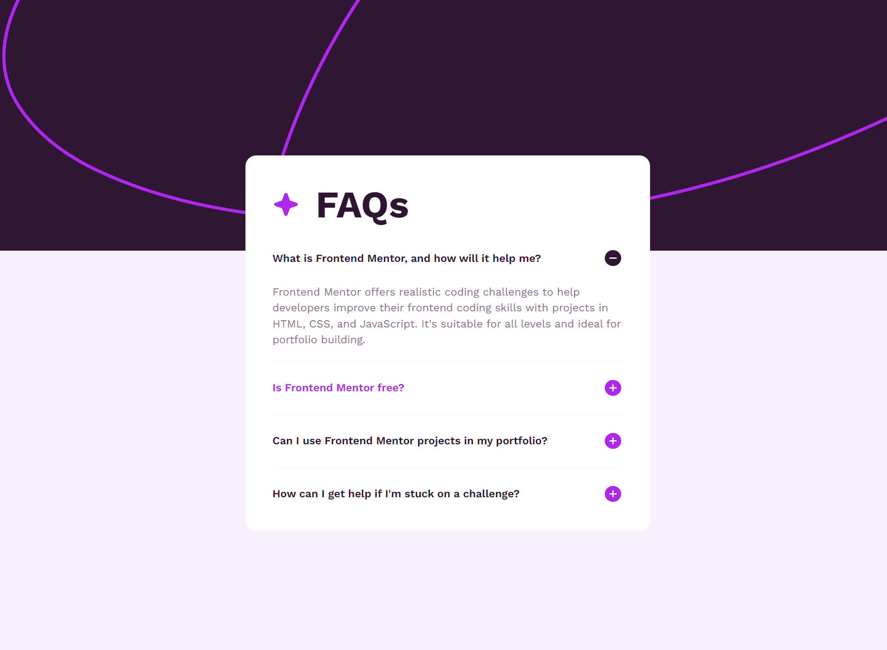
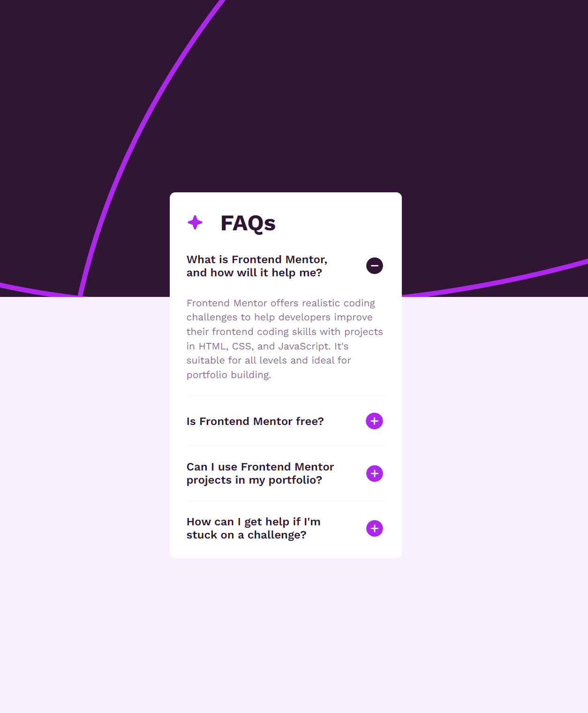

# Introduction

JGNNQ HTKGPF I'm Szeri👋, 
it was very long road ... this simple project makes me understand that the devil is in a details. You can code this solution in a 10 minutes, but ... if you really want to make that your soultion meet this [4 subpoints](#the-challenge) you neet to have good fundamentials. 

In my case I had to choose between writing entirely my own code or using `<details>` and `<summary>` tags and losing full control of the code. What I mean is that if you use ready-made code, you have to read a lot and know exactly what it does. 
During my first session, I chose the predefined tags and everything was fine. I styled them and started animating them. I used CSS animation and JavaScript eventListener. At first glance, everything was fine. On the first click, all sections were animated and accessibility worked fine, but... when I opened the same section a second time, the animation didn't work. As I said, I leave you a link to a [useful article](https://css-tricks.com/how-to-animate-the-details-element-using-waapi/) sent to me by @Klrfl from the discord group, thanks man. 

I knew that this predefined tags could be problematic and I was right, so I decided to write my own code that animates and triggers the animation when the button is clicked. I will give myself time and come back stronger to complete the task based on predefined elements, for now the job has been done and all assumptions have been met.

I improved my code by renaming elements in BEM metodology and I followed the advice from Fluffy Kas that she sent me [here](https://www.frontendmentor.io/solutions/faq-accordion-gulp-sassscss-accessibility-Xz93IYYDqu), thank you @FluffyKas. 


# Frontend Mentor - FAQ accordion solution

This is a solution to the [FAQ accordion challenge on Frontend Mentor](https://www.frontendmentor.io/challenges/faq-accordion-wyfFdeBwBz). Frontend Mentor challenges help you improve your coding skills by building realistic projects. 

## Table of contents

- [Overview](#overview)
  - [The challenge](#the-challenge)
  - [Screenshot](#screenshot)
  - [Links](#links)
- [My process](#my-process)
  - [Built with](#built-with)
  - [What I learned](#what-i-learned)
  - [Continued development](#continued-development)
  - [Useful resources](#useful-resources)
- [Author](#author)
- [Acknowledgments](#acknowledgments)

## Overview

### The challenge

Users should be able to:

- Hide/Show the answer to a question when the question is clicked
- Navigate the questions and hide/show answers using keyboard navigation alone
- View the optimal layout for the interface depending on their device's screen size
- See hover and focus states for all interactive elements on the page

### Screenshot





### Links

- Live Site URL: [Github hosting](https://szeri323.github.io/projects/others/frontendmentor/4.FAQAccordion/faq-accordion.html)
- Solution URL: [Frontend Mentor soultion page](https://www.frontendmentor.io/solutions/faq-accordion-gulp-sassscss-accessibility-Xz93IYYDqu)

## My process

### Built with

- HTML
- SCSS custom properties
- CSS animations
- Flexbox
- Mobile-first workflow
- keeping rules of accessibility
- [Gulp](https://gulpjs.com/) - A toolkit to automate & enhance your workflow
- [npm](https://nodejs.org/en) - NodeJS package manager

### What I learned

I've learned that it depends on me how I naming my elements, the most important is to stick the way I choosed. My bigest demon was when I had tripple nested monster liked this:
```html 
<div class="list">
    <div class="list_item">
        <div class="list_item_header">
            <h3>
            
            
        </div
        <div class="list_item_content">
            <p> some content </p>
        </div>
    </div>
</div>
and I learn that I can name using BEM and don't wory about tripple nested:
<div class="list">
  <div class="list__item">
    <div class="list__item-header">
      <h3 class="list__item-title">Tytuł</h3>
      
      
    </div>
    <div class="list__item-content">
      <p class="list__item-text">Coś tam</p>
    </div>
  </div>
</div>
```

### Continued development

I still want to get better in naming elements and making better html structure for reuse.

### Useful resources

- [Details and Summary tags customization](https://css-tricks.com/how-to-animate-the-details-element-using-waapi/) - This article describes how to add animations for opening and closing details content.
- [BEM naming methodology](https://getbem.com/naming/) - If you want to start naming elements using some scheme, I recommend using BEM. I used this site to help out a bit. :P

## Author

- Website - [centerdiv.pl](https://centerdiv.pl)
- Frontend Mentor - [@Szeri323](https://www.frontendmentor.io/profile/Szeri323)

## Acknowledgments

I want to say thanks to @Klrfl🏅 and @FluffyKas🏅. 
